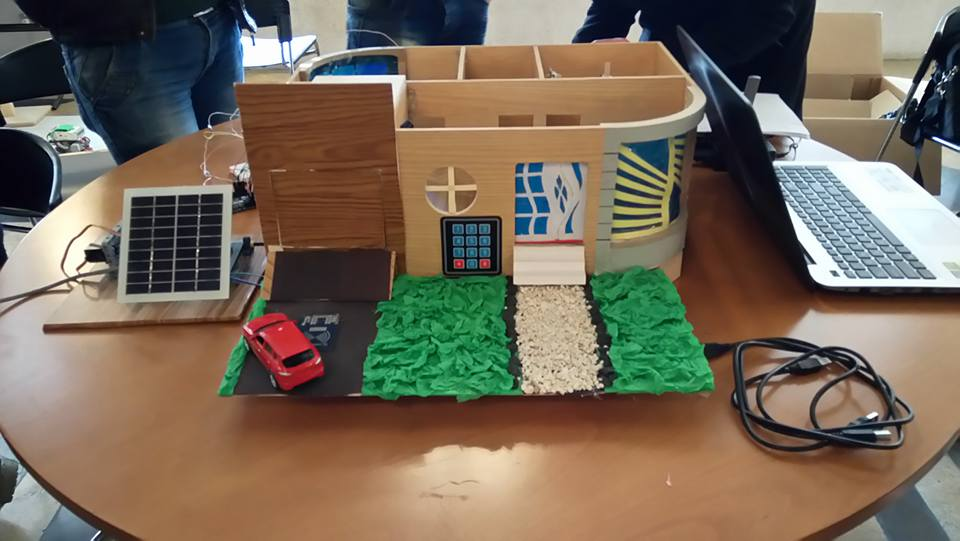
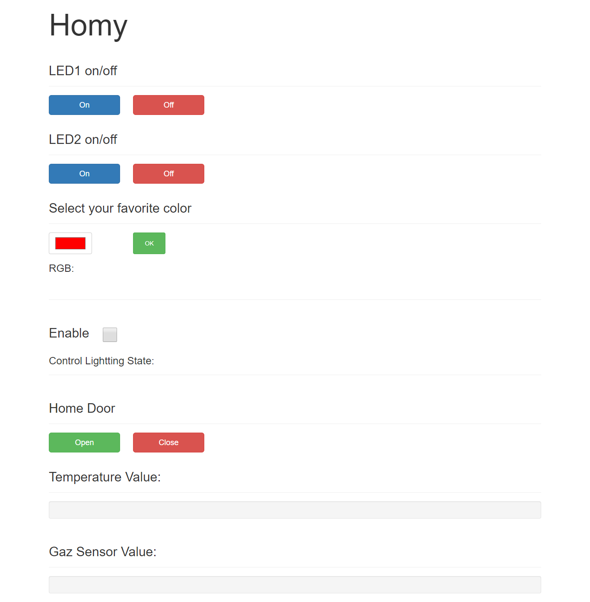

# Homy-Smart-house-IoT

Homy is an application of the Internet of Things (IoT) in Building Management System (BMS) which aid to control building from anywhere in this world by the internet.
It has been applied in a house which possible to control in it using a page of a website with a simple and easy interface that allow you to looking at the reading of the existing sensors and send the commands to the actuators.

## Web page

#Youtube Video 
[Link](https://www.youtube.com/watch?v=o_6mrUkp5co)
